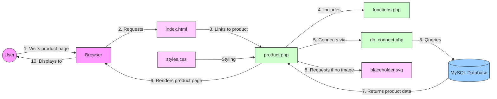
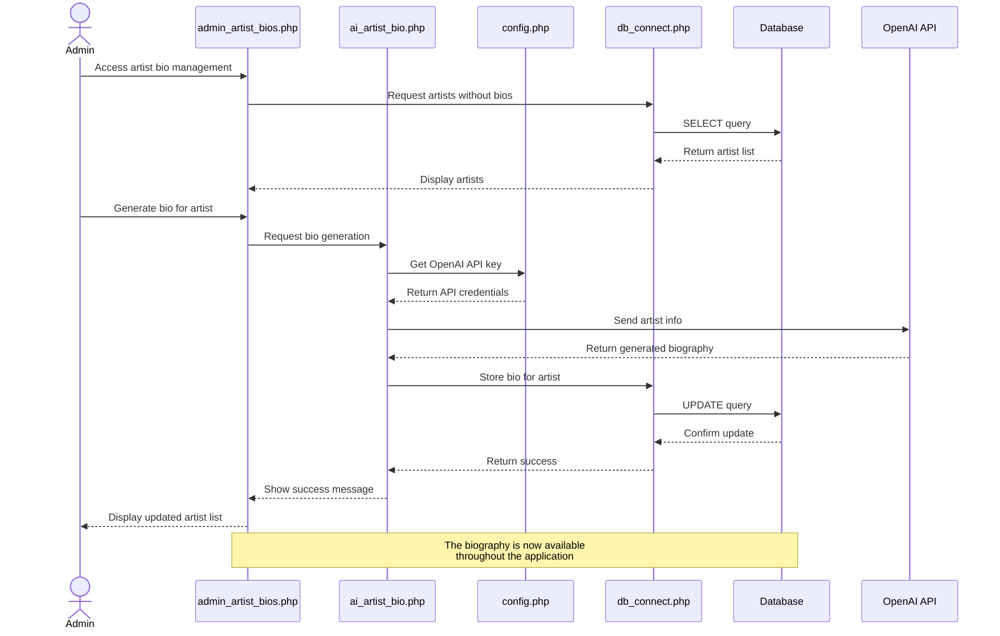
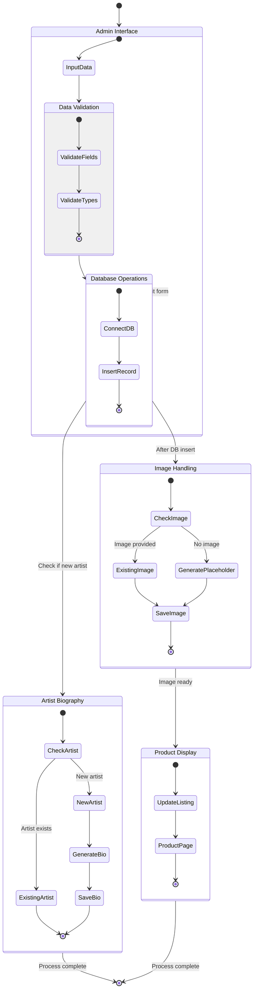

# Accord Music Store - Component Interactions

## 1. Product Display Flow Diagram



## 2. Artist Biography Generation Flow



## 3. Component Integration Map

```mermaid
flowchart TD
    classDef php fill:#cfc,stroke:#333,stroke-width:1px
    classDef python fill:#fcf,stroke:#333,stroke-width:1px
    classDef database fill:#9cf,stroke:#333,stroke-width:1px
    classDef external fill:#ffc,stroke:#333,stroke-width:1px
    classDef template fill:#ddf,stroke:#333,stroke-width:1px
    
    %% PHP Files
    IndexPHP[index.php]
    ProductPHP[product.php]
    ProductsPHP[products.php]
    ArtistPHP[artist.php]
    FunctionsPHP[functions.php]
    DbConnectPHP[db_connect.php]
    ConfigPHP[config.php]
    AiBioPHP[ai_artist_bio.php]
    AdminBiosPHP[admin_artist_bios.php]
    SetupOpenAIPHP[setup_openai.php]
    
    %% Python Files
    AppPY[app.py]
    ConfigPY[config.py]
    
    %% Templates and Assets
    Templates[HTML Templates]
    CSS[CSS Styles]
    JS[JavaScript]
    
    %% Database and External
    MySQL[(MySQL Database)]
    OpenAI[OpenAI API]
    FileSystem[File System]
    
    %% PHP Connections
    IndexPHP -->|includes| FunctionsPHP
    IndexPHP -->|connects via| DbConnectPHP
    ProductPHP -->|includes| FunctionsPHP
    ProductPHP -->|connects via| DbConnectPHP
    ProductsPHP -->|includes| FunctionsPHP
    ProductsPHP -->|connects via| DbConnectPHP
    ArtistPHP -->|includes| FunctionsPHP
    ArtistPHP -->|connects via| DbConnectPHP
    ArtistPHP -->|may use| AiBioPHP
    AdminBiosPHP -->|uses| AiBioPHP
    AdminBiosPHP -->|connects via| DbConnectPHP
    AiBioPHP -->|uses| ConfigPHP
    AiBioPHP -->|connects via| DbConnectPHP
    SetupOpenAIPHP -->|configures| ConfigPHP
    DbConnectPHP -->|queries| MySQL
    
    %% Python Connections
    AppPY -->|uses| ConfigPY
    AppPY -->|renders| Templates
    AppPY -->|queries| MySQL
    
    %% Asset Connections
    Templates -->|styled by| CSS
    Templates -->|enhanced by| JS
    
    %% External Connections
    AiBioPHP -->|calls| OpenAI
    ConfigPHP -->|reads from| FileSystem
    ConfigPY -->|reads from| FileSystem
    
    class IndexPHP,ProductPHP,ProductsPHP,ArtistPHP,FunctionsPHP,DbConnectPHP,ConfigPHP,AiBioPHP,AdminBiosPHP,SetupOpenAIPHP php
    class AppPY,ConfigPY python
    class MySQL database
    class OpenAI,FileSystem external
    class Templates,CSS,JS template
```



## 4. Real-World Use Case: Adding a New Product



## 5. PHP and Flask Communication

```mermaid
flowchart LR
    classDef php fill:#cfc,stroke:#333,stroke-width:1px
    classDef python fill:#fcf,stroke:#333,stroke-width:1px
    classDef shared fill:#ffc,stroke:#333,stroke-width:1px
    
    %% PHP Components
    subgraph PHPApp[PHP Application]
        direction TB
        IndexPHP[index.php]
        ProductPHP[product.php]
        ArtistPHP[artist.php]
        DbConnectPHP[db_connect.php]
        ConfigPHP[config.php]
    end
    
    %% Flask Components
    subgraph FlaskApp[Flask Application]
        direction TB
        AppPY[app.py]
        ConfigPY[config.py]
        Templates[Templates]
    end
    
    %% Shared Resources
    subgraph SharedResources[Shared Resources]
        direction TB
        MySQL[(MySQL Database)]
        EnvFile[.env file]
        FileSystem[File System\n(images, assets)]
    end
    
    %% Connections
    PHPApp -->|reads/writes| MySQL
    FlaskApp -->|reads/writes| MySQL
    PHPApp -->|reads| EnvFile
    FlaskApp -->|reads| EnvFile
    PHPApp -->|reads/writes| FileSystem
    FlaskApp -->|reads| FileSystem
    
    class IndexPHP,ProductPHP,ArtistPHP,DbConnectPHP,ConfigPHP php
    class AppPY,ConfigPY,Templates python
    class MySQL,EnvFile,FileSystem shared
```

## 6. Data Flow Through Database Tables

```mermaid
erDiagram
    PRODUCTS {
        int id PK
        string artist
        string album_title
        string format
        decimal price
        string image_url
        date release_date
        string genre
        int media_count
        text description
        text artist_bio
        string status
        timestamp created_at
    }
    
    USERS {
        int id PK
        string username
        string password
        string email
        timestamp created_at
    }
    
    ORDERS {
        int id PK
        int user_id FK
        decimal total_amount
        string status
        timestamp created_at
    }
    
    ORDER_ITEMS {
        int id PK
        int order_id FK
        int product_id FK
        int quantity
        decimal price
    }
    
    USERS ||--o{ ORDERS : places
    ORDERS ||--o{ ORDER_ITEMS : contains
    PRODUCTS ||--o{ ORDER_ITEMS : includes
    
    note on PRODUCTS {
        Holds all music product information
        including artist bios generated by OpenAI
    }
    
    note on USERS {
        Customer accounts
        (Future implementation)
    }
    
    note on ORDERS {
        Customer purchase records
        (Future implementation)
    }
```

## Key Interaction Points

The diagrams above visualize several critical interaction points:

1. **PHP Files and Database**: PHP files like `product.php` and `artist.php` interact with the database through `db_connect.php`

2. **OpenAI Integration**: The `ai_artist_bio.php` file bridges the application and the OpenAI API, storing results in the database

3. **Dual Application Architecture**: PHP and Flask applications coexist, sharing the same database and file resources

4. **Product Management Flow**: Adding products involves multiple components including validation, database operations, and image handling

5. **Database as Integration Hub**: The MySQL database serves as the central integration point between different parts of the application 