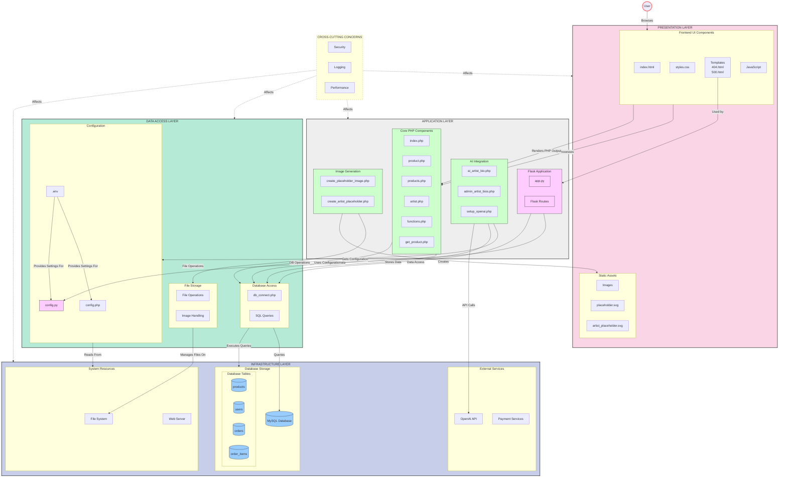

# Enhanced Accord Music Store Architecture

## Improved Integrated Architecture Diagram



## Key Features of This Enhanced Diagram

1. **Improved Visual Hierarchy**
   - Clearer grouping of related components
   - More logical subgraph organization
   - Enhanced layer boundaries

2. **Simplified Connection Lines**
   - Reduced visual clutter by connecting at group level where possible
   - More descriptive connection labels
   - Highlighted primary user flow paths

3. **Better Component Organization**
   - Logical grouping of related components within each layer
   - Database tables properly nested under MySQL Database
   - More consistent direction within subgraphs

4. **Enhanced Visual Differentiation**
   - Stronger color distinction between layers
   - Different line styles for different types of connections
   - Emphasized user entry point
   - Technology-specific styling (PHP vs Python vs Database)

5. **Improved Readability**
   - Top-to-bottom main flow for easier reading
   - Left-to-right organization within each layer
   - More consistent naming patterns
   - ALL CAPS for layer names to improve scannability

This enhanced diagram maintains all the information from the original while making the architecture more immediately understandable and visually approachable.

## Primary Data Flows Visualization

```mermaid
flowchart LR
    classDef request fill:#f9f,stroke:#333,stroke-width:1px
    classDef response fill:#9cf,stroke:#333,stroke-width:1px
    
    subgraph "Product Display Flow"
        direction TB
        R1[User Requests Product] ---|1. HTTP Request|--> R2[product.php]
        R2 ---|2. Data Request|--> R3[db_connect.php]
        R3 ---|3. SQL Query|--> R4[MySQL Database]
        R4 -.->|4. Product Data| R3
        R3 -.->|5. Data| R2
        R2 -.->|6. HTML Response| R1
    end
    
    subgraph "Artist Bio Generation"
        direction TB
        A1[Admin Requests Bio Generation] ---|1. Form Submit|--> A2[admin_artist_bios.php]
        A2 ---|2. Generation Request|--> A3[ai_artist_bio.php]
        A3 ---|3. API Key Request|--> A4[config.php]
        A3 ---|4. API Call|--> A5[OpenAI API]
        A5 -.->|5. Generated Bio| A3
        A3 ---|6. DB Connection|--> A6[db_connect.php]
        A6 ---|7. Store Bio|--> A7[MySQL Database]
        A7 -.->|8. Confirmation| A6
        A6 -.->|9. Success| A3
        A3 -.->|10. Update| A2
        A2 -.->|11. Success Page| A1
    end
    
    class R1,A1 request
    class R4,A5,A7 response
```

This enhanced visualization provides a clearer picture of your architecture while maintaining all the detailed component relationships from the original diagram. 