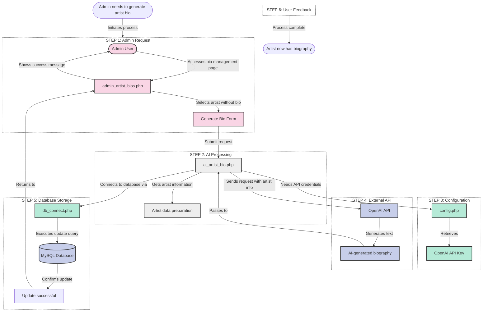
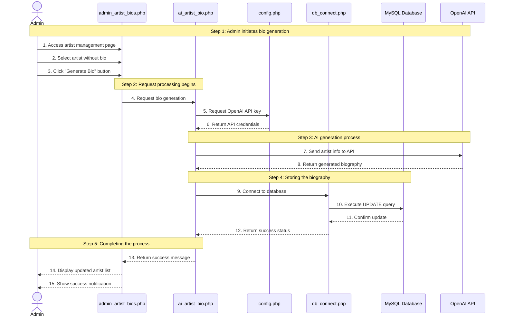

# Improved Artist Biography Generation Flow

This diagram provides a clearer visualization of how artist biographies are generated in the Accord Music Store application.

## Simplified Artist Biography Generation Flow

## Alternative Visual: Sequential Artist Bio Generation

## Data and Control Flow Diagram

```mermaid
stateDiagram-v2
    [*] --> AdminInterface: Admin initiates process
    
    state AdminInterface {
        [*] --> ViewArtists: Admin accesses page
        ViewArtists --> SelectArtist: Choose artist without bio
        SelectArtist --> RequestGeneration: Click generate button
        RequestGeneration --> [*]: Submit request
    }
    
    AdminInterface --> ProcessingBio: Form submitted
    
    state ProcessingBio {
        [*] --> GetConfig: Retrieve API configuration
        GetConfig --> PrepareRequest: Create API request
        PrepareRequest --> CallAPI: Send to OpenAI
        CallAPI --> ProcessResponse: Receive biography
        ProcessResponse --> [*]: Biography generated
    }
    
    ProcessingBio --> StoringBio: Biography ready
    
    state StoringBio {
        [*] --> ConnectDB: Connect to database
        ConnectDB --> UpdateArtist: Update artist record
        UpdateArtist --> VerifyUpdate: Check success
        VerifyUpdate --> [*]: Update verified
    }
    
    StoringBio --> AdminFeedback: Storage successful
    
    state AdminFeedback {
        [*] --> PrepareUI: Update admin UI
        PrepareUI --> ShowSuccess: Display success message
        ShowSuccess --> RefreshList: Update artist list
        RefreshList --> [*]: UI updated
    }
    
    AdminFeedback --> [*]: Process complete
```

## Key Improvements in These Visualizations

1. **Clear Stepwise Progression**
   - The process is now divided into logical, numbered steps
   - Each step is visually separated for better understanding
   - Clear starting and ending points

2. **Multiple Visualization Options**
   - Flowchart for component relationships and data flow
   - Sequence diagram for temporal understanding of the process
   - State diagram for process state transitions

3. **Visual Differentiation**
   - Color coding by layer/component type
   - Different line styles for different types of operations
   - Grouped related operations together

4. **Reduced Complexity**
   - Focused solely on the Artist Biography Generation flow
   - Eliminated unnecessary details while preserving the complete process
   - Better spacing and organization of elements

5. **Clear Process Narrative**
   - Each diagram provides a clear story of how the feature works
   - Steps are labeled with informative descriptions
   - Flow direction is more intuitive

These improved visualizations make it much easier to understand the Artist Biography Generation process from both technical and functional perspectives. 