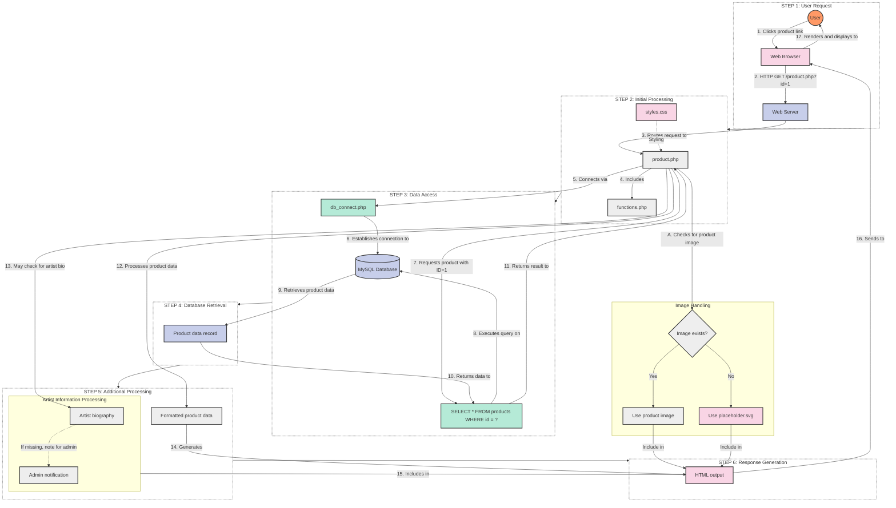
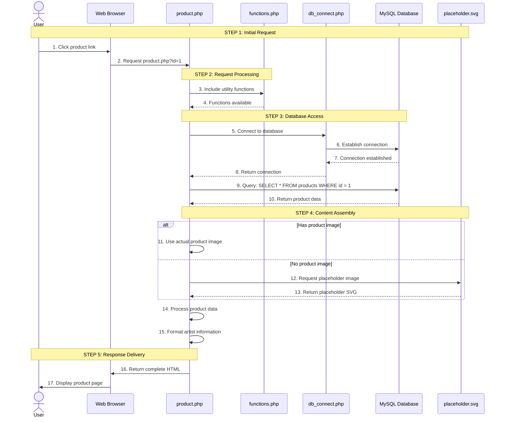

# Improved Cross-Cutting Concerns and Product Page Flow

This file provides clearer visualizations of two important aspects of the Accord Music Store architecture: how cross-cutting concerns affect all layers and the complete flow of a product page request.

## Enhanced Cross-Cutting Concerns Visualization

```mermaid
flowchart TB
    %% Style definitions for better visual clarity
    classDef presentationLayer fill:#f9d5e5,stroke:#333,stroke-width:2px
    classDef applicationLayer fill:#eeeeee,stroke:#333,stroke-width:2px
    classDef dataAccessLayer fill:#b5ead7,stroke:#333,stroke-width:2px
    classDef infrastructureLayer fill:#c7ceea,stroke:#333,stroke-width:2px
    classDef securityConcern fill:#ffcccb,stroke:#990000,stroke-width:1px
    classDef loggingConcern fill:#fffacd,stroke:#b8860b,stroke-width:1px
    classDef performanceConcern fill:#e6e6fa,stroke:#483d8b,stroke-width:1px
    
    %% Cross-Cutting Concerns
    subgraph CC[CROSS-CUTTING CONCERNS]
        direction LR
        
        subgraph Security[SECURITY]
            SecAuth[Authentication &\nAuthorization]
            SecData[Data Protection]
            SecInput[Input Validation]
        end
        
        subgraph Logging[LOGGING]
            LogError[Error Tracking]
            LogAudit[Audit Logging]
            LogMetrics[Performance Metrics]
        end
        
        subgraph Performance[PERFORMANCE]
            PerfCache[Caching]
            PerfOpt[Optimization]
            PerfScale[Scalability]
        end
    end
    
    %% Application Layers
    subgraph PL[PRESENTATION LAYER]
        direction LR
        PL_S[Security\nUser Authentication\nCSRF Protection\nSecure Forms]
        PL_L[Logging\nClient-side Errors\nUser Interactions\nUI Metrics]
        PL_P[Performance\nAsset Optimization\nUI Responsiveness\nPage Load Speed]
    end
    
    subgraph AL[APPLICATION LAYER]
        direction LR
        AL_S[Security\nSession Management\nRole-based Access\nInput Sanitization]
        AL_L[Logging\nBusiness Logic Errors\nOperation Tracking\nAudit Trails]
        AL_P[Performance\nCode Optimization\nMemory Management\nCaching Strategies]
    end
    
    subgraph DAL[DATA ACCESS LAYER]
        direction LR
        DAL_S[Security\nQuery Sanitization\nConnection Security\nCredential Protection]
        DAL_L[Logging\nQuery Performance\nData Access Patterns\nError States]
        DAL_P[Performance\nQuery Optimization\nConnection Pooling\nData Indexing]
    end
    
    subgraph IL[INFRASTRUCTURE LAYER]
        direction LR
        IL_S[Security\nDatabase Security\nAPI Authentication\nNetwork Protection]
        IL_L[Logging\nSystem Events\nResource Usage\nSecurity Incidents]
        IL_P[Performance\nHardware Resources\nScaling Policies\nLoad Balancing]
    end
    
    %% Connections for Security
    SecAuth -.->|Implements| PL_S
    SecAuth -.->|Implements| AL_S
    SecAuth -.->|Implements| DAL_S
    SecAuth -.->|Implements| IL_S
    
    SecData -.->|Implements| PL_S
    SecData -.->|Implements| AL_S
    SecData -.->|Implements| DAL_S
    SecData -.->|Implements| IL_S
    
    SecInput -.->|Implements| PL_S
    SecInput -.->|Implements| AL_S
    SecInput -.->|Implements| DAL_S
    
    %% Connections for Logging
    LogError -.->|Implements| PL_L
    LogError -.->|Implements| AL_L
    LogError -.->|Implements| DAL_L
    LogError -.->|Implements| IL_L
    
    LogAudit -.->|Implements| AL_L
    LogAudit -.->|Implements| DAL_L
    LogAudit -.->|Implements| IL_L
    
    LogMetrics -.->|Implements| PL_L
    LogMetrics -.->|Implements| AL_L
    LogMetrics -.->|Implements| DAL_L
    LogMetrics -.->|Implements| IL_L
    
    %% Connections for Performance
    PerfCache -.->|Implements| PL_P
    PerfCache -.->|Implements| AL_P
    PerfCache -.->|Implements| DAL_P
    
    PerfOpt -.->|Implements| PL_P
    PerfOpt -.->|Implements| AL_P
    PerfOpt -.->|Implements| DAL_P
    PerfOpt -.->|Implements| IL_P
    
    PerfScale -.->|Implements| AL_P
    PerfScale -.->|Implements| DAL_P
    PerfScale -.->|Implements| IL_P
    
    %% Apply styles
    class PL presentationLayer
    class AL applicationLayer
    class DAL dataAccessLayer
    class IL infrastructureLayer
    class SecAuth,SecData,SecInput,PL_S,AL_S,DAL_S,IL_S securityConcern
    class LogError,LogAudit,LogMetrics,PL_L,AL_L,DAL_L,IL_L loggingConcern
    class PerfCache,PerfOpt,PerfScale,PL_P,AL_P,DAL_P,IL_P performanceConcern
```

## Simplified Alternative: Cross-Cutting Concerns Matrix

```mermaid
flowchart TB
    classDef presentationLayer fill:#f9d5e5,stroke:#333,stroke-width:2px
    classDef applicationLayer fill:#eeeeee,stroke:#333,stroke-width:2px
    classDef dataAccessLayer fill:#b5ead7,stroke:#333,stroke-width:2px
    classDef infrastructureLayer fill:#c7ceea,stroke:#333,stroke-width:2px
    classDef securityConcern fill:#ffcccb,stroke:#333,stroke-width:1px
    classDef loggingConcern fill:#fffacd,stroke:#333,stroke-width:1px
    classDef performanceConcern fill:#e6e6fa,stroke:#333,stroke-width:1px
    
    %% Concerns at top level
    Security[SECURITY]:::securityConcern
    Logging[LOGGING]:::loggingConcern
    Performance[PERFORMANCE]:::performanceConcern
    
    %% Layers at side
    PL[PRESENTATION LAYER]:::presentationLayer
    AL[APPLICATION LAYER]:::applicationLayer
    DAL[DATA ACCESS LAYER]:::dataAccessLayer
    IL[INFRASTRUCTURE LAYER]:::infrastructureLayer
    
    %% Matrix implementation nodes
    PL_S[User Authentication<br>CSRF Protection<br>Secure Forms]:::securityConcern
    PL_L[Client-side Errors<br>User Interactions<br>UI Metrics]:::loggingConcern
    PL_P[Asset Optimization<br>UI Responsiveness<br>Page Load Speed]:::performanceConcern
    
    AL_S[Session Management<br>Role-based Access<br>Input Sanitization]:::securityConcern
    AL_L[Business Logic Errors<br>Operation Tracking<br>Audit Trails]:::loggingConcern
    AL_P[Code Optimization<br>Memory Management<br>Caching Strategies]:::performanceConcern
    
    DAL_S[Query Sanitization<br>Connection Security<br>Credential Protection]:::securityConcern
    DAL_L[Query Performance<br>Data Access Patterns<br>Error States]:::loggingConcern
    DAL_P[Query Optimization<br>Connection Pooling<br>Data Indexing]:::performanceConcern
    
    IL_S[Database Security<br>API Authentication<br>Network Protection]:::securityConcern
    IL_L[System Events<br>Resource Usage<br>Security Incidents]:::loggingConcern
    IL_P[Hardware Resources<br>Scaling Policies<br>Load Balancing]:::performanceConcern
    
    %% Connections - security
    Security --> PL_S
    Security --> AL_S
    Security --> DAL_S
    Security --> IL_S
    
    %% Connections - logging
    Logging --> PL_L
    Logging --> AL_L
    Logging --> DAL_L
    Logging --> IL_L
    
    %% Connections - performance
    Performance --> PL_P
    Performance --> AL_P
    Performance --> DAL_P
    Performance --> IL_P
    
    %% Connections - layers
    PL --> PL_S
    PL --> PL_L
    PL --> PL_P
    
    AL --> AL_S
    AL --> AL_L
    AL --> AL_P
    
    DAL --> DAL_S
    DAL --> DAL_L
    DAL --> DAL_P
    
    IL --> IL_S
    IL --> IL_L
    IL --> IL_P
```

## Enhanced Product Page Request Flow

## Sequence Diagram: Product Page Request

## State Diagram: Product Page Request

```mermaid
stateDiagram-v2
    [*] --> UserInteraction: User initiates
    
    state UserInteraction {
        [*] --> BrowsingProducts
        BrowsingProducts --> ProductSelection: Click product link
        ProductSelection --> [*]: Request sent
    }
    
    UserInteraction --> RequestProcessing: HTTP Request
    
    state RequestProcessing {
        [*] --> RouterHandling: Web server routes request
        RouterHandling --> PHPProcessing: Route to product.php
        PHPProcessing --> IncludeFunctions: Include functions.php
        IncludeFunctions --> [*]: Initial processing complete
    }
    
    RequestProcessing --> DataRetrieval: Need product data
    
    state DataRetrieval {
        [*] --> DBConnection: Connect to database
        DBConnection --> QueryExecution: Prepare SQL query
        QueryExecution --> ResultProcessing: Execute query
        ResultProcessing --> [*]: Data retrieved
    }
    
    DataRetrieval --> ContentAssembly: With product data
    
    state ContentAssembly {
        [*] --> DataFormatting: Format product data
        DataFormatting --> ImageHandling: Handle product image
        
        state ImageHandling {
            [*] --> CheckImage
            CheckImage --> UseRealImage: Image exists
            CheckImage --> UsePlaceholder: No image
            UseRealImage --> [*]
            UsePlaceholder --> [*]
        }
        
        ImageHandling --> HTMLGeneration: Assemble page content
        HTMLGeneration --> [*]: Page ready
    }
    
    ContentAssembly --> ResponseDelivery: HTML ready
    
    state ResponseDelivery {
        [*] --> SendResponse: Send to browser
        SendResponse --> RenderPage: Browser processes HTML
        RenderPage --> [*]: Page displayed
    }
    
    ResponseDelivery --> [*]: Process complete
```

## Key Improvements in These Visualizations

### Cross-Cutting Concerns Improvements

1. **Greater Detail and Specificity**
   - Added specific implementations for each concern in each layer
   - Clearer mapping of which concerns affect which layers
   - Better organization of related security, logging, and performance aspects

2. **Improved Visual Organization**
   - Clearer grouping of related elements
   - Better visual separation between layers and concerns
   - More intuitive layout and connection patterns

3. **Color-Coding by Concern Type**
   - Security concerns in light red
   - Logging concerns in light yellow
   - Performance concerns in light purple
   - Layer-specific coloring maintained for clarity

4. **Alternative Matrix View**
   - Simpler, more structured representation as an alternative
   - Clear mapping between concerns and layers
   - Easier to scan and understand at a glance

### Product Page Request Flow Improvements

1. **Clear Step-by-Step Progression**
   - Organized into 6 logical, numbered steps
   - Each step contained in its own subgraph
   - Clear progression from user request to response

2. **Multiple Visualization Options**
   - Flowchart for component relationships and data flow
   - Sequence diagram for temporal understanding
   - State diagram for process state transitions

3. **Enhanced Detail and Context**
   - Added image handling subflow
   - Numbered steps for easier reference
   - More detailed description of each operation

4. **Improved Visual Clarity**
   - Consistent color-coding by layer
   - Better spacing and organization
   - Reduced visual clutter
   - Clearer connection labels

These improved visualizations make it much easier to understand both how cross-cutting concerns affect the entire application and the complete flow of a product page request. 