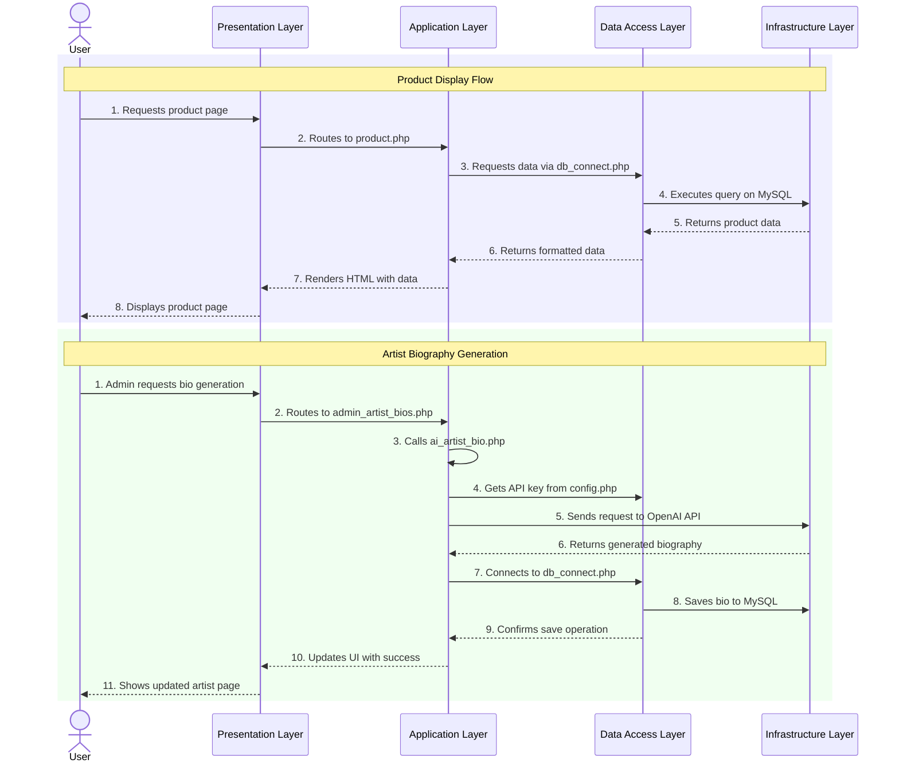
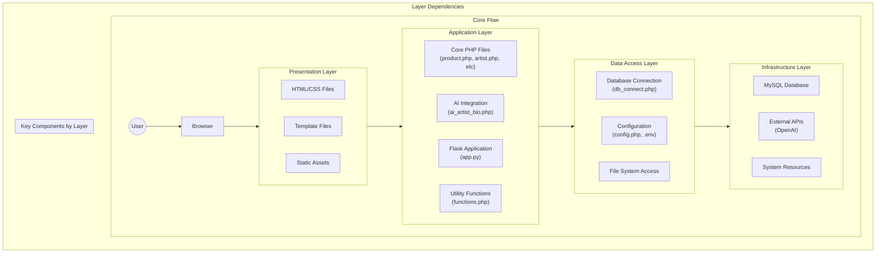
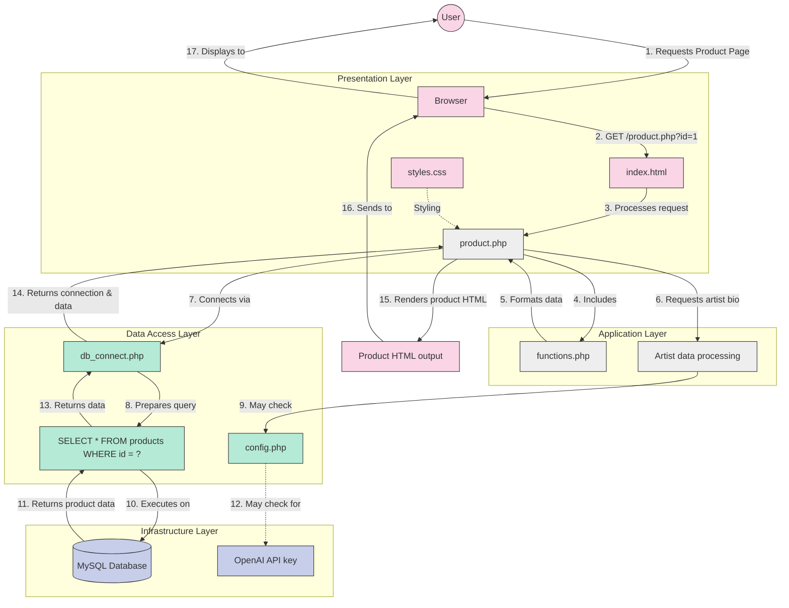

# Accord Music Store - Integrated Layered Architecture

This diagram shows how components within each architectural layer connect to each other across the entire application.

## Complete Integrated Architecture Diagram

```mermaid
flowchart TD
    %% Style definitions
    classDef presentationLayer fill:#f9d5e5,stroke:#333,stroke-width:1px
    classDef applicationLayer fill:#eeeeee,stroke:#333,stroke-width:1px
    classDef dataAccessLayer fill:#b5ead7,stroke:#333,stroke-width:1px
    classDef infrastructureLayer fill:#c7ceea,stroke:#333,stroke-width:1px
    classDef php fill:#cfc,stroke:#333,stroke-width:1px,stroke-dasharray: 5 5
    classDef python fill:#fcf,stroke:#333,stroke-width:1px,stroke-dasharray: 5 5
    
    %% PRESENTATION LAYER
    subgraph PL[Presentation Layer]
        IndexHTML[index.html]
        StylesCSS[styles.css]
        Templates[Templates\n404.html\n500.html]
        JSScripts[JavaScript]
        Assets[Static Assets\nImages]
        Placeholder[placeholder.svg]
        ArtistPlaceholder[artist_placeholder.svg]
    end
    
    %% APPLICATION LAYER
    subgraph AL[Application Layer]
        %% PHP components
        subgraph PHP_Components[PHP Components]
            IndexPHP[index.php]
            ProductPHP[product.php]
            ProductsPHP[products.php]
            ArtistPHP[artist.php]
            FunctionsPHP[functions.php]
            GetProductPHP[get_product.php]
        end
        
        %% AI Integration
        subgraph AI_Integration[AI Integration]
            AiBioPHP[ai_artist_bio.php]
            AdminBiosPHP[admin_artist_bios.php]
            SetupOpenAIPHP[setup_openai.php]
        end
        
        %% Flask Application
        subgraph Flask_App[Flask Application]
            AppPY[app.py]
            FlaskRoutes[Flask Routes]
        end
        
        %% Image Generation
        subgraph Image_Gen[Image Generation]
            CreatePlaceholder[create_placeholder_image.php]
            CreateArtistPlaceholder[create_artist_placeholder.php]
        end
    end
    
    %% DATA ACCESS LAYER
    subgraph DAL[Data Access Layer]
        %% Database Access
        subgraph DB_Access[Database Access]
            DbConnectPHP[db_connect.php]
            SQLQueries[SQL Queries]
        end
        
        %% Configuration
        subgraph Configuration[Configuration]
            ConfigPHP[config.php]
            ConfigPY[config.py]
            EnvFile[.env]
        end
        
        %% File Storage
        subgraph File_Storage[File Storage]
            FileOps[File Operations]
            ImageHandling[Image Handling]
        end
    end
    
    %% INFRASTRUCTURE LAYER
    subgraph IL[Infrastructure Layer]
        %% Database
        subgraph DB_Storage[Database Storage]
            MySQL[(MySQL Database)]
            Products[(products table)]
            Users[(users table)]
            Orders[(orders table)]
            OrderItems[(order_items table)]
        end
        
        %% External Services
        subgraph Ext_Services[External Services]
            OpenAI[OpenAI API]
            FuturePayment[Future Payment Services]
        end
        
        %% System Resources
        subgraph Sys_Resources[System Resources]
            FileSystem[File System]
            WebServer[Web Server]
        end
    end
    
    %% CROSS-CUTTING CONCERNS
    subgraph CC[Cross-Cutting Concerns]
        Security[Security]
        Logging[Logging]
        Performance[Performance]
    end
    
    %% CONNECTIONS ACROSS LAYERS
    
    %% Presentation to Application connections
    IndexHTML --> IndexPHP
    IndexHTML --> ProductPHP
    IndexHTML --> ProductsPHP
    IndexHTML --> ArtistPHP
    StylesCSS -.-> IndexPHP
    StylesCSS -.-> ProductPHP
    StylesCSS -.-> ProductsPHP
    StylesCSS -.-> ArtistPHP
    Templates --> AppPY
    
    %% Application to Data Access connections
    IndexPHP --> DbConnectPHP
    ProductPHP --> DbConnectPHP
    ProductsPHP --> DbConnectPHP
    ArtistPHP --> DbConnectPHP
    GetProductPHP --> DbConnectPHP
    
    FunctionsPHP -.-> IndexPHP
    FunctionsPHP -.-> ProductPHP
    FunctionsPHP -.-> ProductsPHP
    FunctionsPHP -.-> ArtistPHP
    
    AiBioPHP --> DbConnectPHP
    AiBioPHP --> ConfigPHP
    AdminBiosPHP --> AiBioPHP
    AdminBiosPHP --> DbConnectPHP
    SetupOpenAIPHP --> ConfigPHP
    
    AppPY --> ConfigPY
    AppPY --> DbConnectPHP
    
    CreatePlaceholder --> FileOps
    CreatePlaceholder --> ImageHandling
    CreateArtistPlaceholder --> FileOps
    CreateArtistPlaceholder --> ImageHandling
    
    %% Data Access to Infrastructure connections
    DbConnectPHP --> MySQL
    SQLQueries --> Products
    SQLQueries --> Users
    SQLQueries --> Orders
    SQLQueries --> OrderItems
    
    ConfigPHP --> FileSystem
    ConfigPY --> FileSystem
    EnvFile --> ConfigPHP
    EnvFile --> ConfigPY
    
    FileOps --> FileSystem
    ImageHandling --> FileSystem
    
    %% Application to Infrastructure (direct) connections
    AiBioPHP --> OpenAI
    
    %% Cross-cutting concerns affect all layers
    CC -.-> PL
    CC -.-> AL
    CC -.-> DAL
    CC -.-> IL
    
    %% Specific component interactions
    CreatePlaceholder --> Placeholder
    CreateArtistPlaceholder --> ArtistPlaceholder
    AdminBiosPHP --> OpenAI
    
    %% Style application
    class PL presentationLayer
    class AL applicationLayer
    class DAL dataAccessLayer
    class IL infrastructureLayer
    class IndexPHP,ProductPHP,ProductsPHP,ArtistPHP,FunctionsPHP,GetProductPHP,AiBioPHP,AdminBiosPHP,SetupOpenAIPHP,CreatePlaceholder,CreateArtistPlaceholder,DbConnectPHP,ConfigPHP php
    class AppPY,FlaskRoutes,ConfigPY python
```

## Layer Communication Patterns

## Component Dependencies Within and Across Layers

## Cross-Cutting Concerns Affecting All Layers

```mermaid
flowchart TD
    CC[Cross-Cutting Concerns]
    
    Security[Security]
    Logging[Logging]
    Performance[Performance]
    
    CC --- Security
    CC --- Logging
    CC --- Performance
    
    subgraph PL[Presentation Layer]
        PLSecurity[Authentication UI\nCSRF Protection]
        PLLogging[Client-side Error Logging]
        PLPerformance[Asset Optimization\nUI Responsiveness]
    end
    
    subgraph AL[Application Layer]
        ALSecurity[Authorization\nInput Validation]
        ALLogging[Error Handling\nAudit Logging]
        ALPerformance[Code Optimization\nCaching]
    end
    
    subgraph DAL[Data Access Layer]
        DALSecurity[Query Sanitization\nConnection Security]
        DALLogging[Query Logging\nError Tracking]
        DALPerformance[Connection Pooling\nQuery Optimization]
    end
    
    subgraph IL[Infrastructure Layer]
        ILSecurity[Database Security\nAPI Authentication]
        ILLogging[System Logs\nDatabase Logs]
        ILPerformance[Hardware Resources\nScaling]
    end
    
    Security --- PLSecurity
    Security --- ALSecurity
    Security --- DALSecurity
    Security --- ILSecurity
    
    Logging --- PLLogging
    Logging --- ALLogging
    Logging --- DALLogging
    Logging --- ILLogging
    
    Performance --- PLPerformance
    Performance --- ALPerformance
    Performance --- DALPerformance
    Performance --- ILPerformance
```

## Sample Data Flow: Complete Product Page Request

This diagram shows how data flows through each layer and component when a user requests a product page:

## Benefits of This Integrated Architecture View

1. **Clear Component Boundaries**: Each component belongs to a specific layer with defined responsibilities

2. **Visible Data Flow**: The diagrams show exactly how data moves through the system, from user request to database and back

3. **Cross-Layer Dependencies**: Highlights how components in different layers interact with each other

4. **Cross-Cutting Concerns**: Shows how security, logging, and performance considerations affect each layer

5. **Technology Integration**: Illustrates how PHP and Flask components work together within the layered architecture

This integrated view provides a comprehensive understanding of both the logical layering of the application and the specific component interactions that implement those logical layers. 