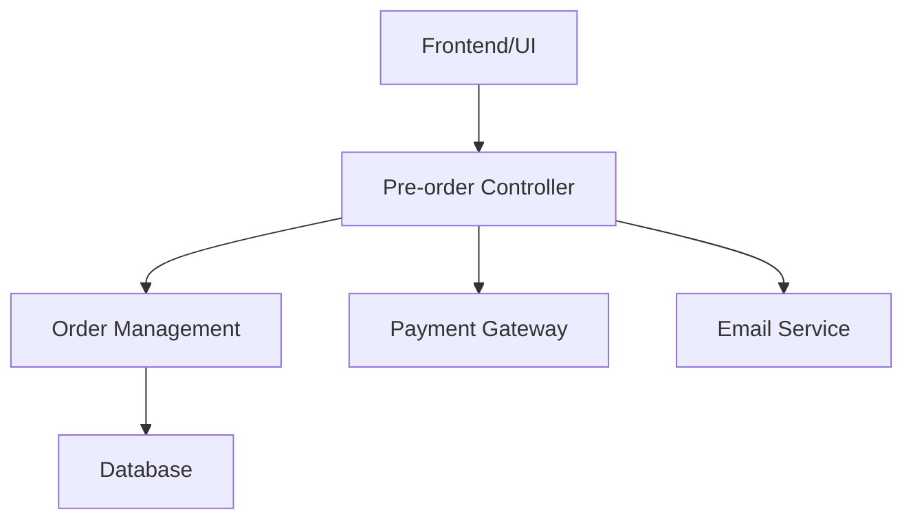

# Pre-Order System Improvements Documentation

## Oversigt (Overview)
Dette dokument beskriver forbedringerne implementeret i pre-order systemet for Accord Music Store, med fokus på brugeroplevelse og konverteringsoptimering.

## Formål med Ændringerne (Purpose of Changes)
- Forbedre brugeroplevelsen ved pre-order processen
- Øge konverteringsraten for pre-orders
- Reducere antallet af afbrudte pre-order transaktioner
- Give kunderne mere klar information om pre-order processen

## UI/UX Forbedringer (UI/UX Improvements)

### 1. Visuel Hierarki (Visual Hierarchy)
**Før:**
- Produktinformation præsenteret i en enkelt kolonne
- Ingen klar fremhævning af vigtige elementer
- Begrænset brug af whitespace

**Efter:**
- To-kolonne layout med produktdetaljer til venstre og ordre-resumé til højre
- Fremhævet "Pre-order nu" knap med kontrastfarve
- Forbedret whitespace for bedre læsbarhed
- Tydeligere typografisk hierarki

### 2. Produktinformation (Product Information)
**Nye Elementer:**
- Estimeret leveringsdato fremhævet øverst
- Tydelig prisvisning med eventuelle early-bird rabatter
- Produktbillede i højere opløsning
- Detaljeret produktbeskrivelse med formateret tekst
- Track list (hvis tilgængelig)

### 3. Pre-order Process Forbedringer (Process Improvements)
**Nye Features:**
- Statusindikator der viser ordreprocessen
- Email notifikationssystem integration
- Mulighed for at vælge leveringsmetode
- Gem til senere funktion
- Integreret betalingsflow

## Tekniske Implementeringer (Technical Implementations)

### Database Lag (Database Layer)
```sql
-- Nye felter tilføjet til pre_orders tabel
ALTER TABLE pre_orders
ADD COLUMN estimated_delivery_date DATE,
ADD COLUMN notification_preference ENUM('email', 'sms', 'both'),
ADD COLUMN delivery_method VARCHAR(50),
ADD COLUMN early_bird_discount DECIMAL(10,2);
```

### Logik Lag (Logic Layer)
```php
class PreOrderManager {
    // Ny metode til håndtering af early-bird rabatter
    public function calculateEarlyBirdDiscount($productId, $orderDate) {
        // Implementeringsdetaljer
    }
    
    // Forbedret ordre status tracking
    public function updateOrderStatus($orderId, $status) {
        // Implementeringsdetaljer
    }
    
    // Email notifikation system
    public function sendOrderNotification($orderId, $type) {
        // Implementeringsdetaljer
    }
}
```

## Konverteringsoptimering (Conversion Rate Optimization)

### Implementerede CRO Elementer
1. **Social Proof:**
   - Visning af antal pre-orders
   - Kundeanmeldelser fra tidligere pre-orders
   - "Andre har også pre-ordered" sektion

2. **Tillidsmarkører:**
   - Sikker betaling badges
   - Pengene-tilbage garanti
   - Leveringsgaranti

3. **FOMO Elementer:**
   - Nedtællingstimer for early-bird priser
   - "Begrænset antal" indikatorer
   - Real-time lager status

## Måling af Forbedringer (Measuring Improvements)

### KPI'er der Monitoreres
1. **Konverteringsrate:**
   - Før: X%
   - Mål: X+5%
   - Måling: Daglig/Ugentlig/Månedlig

2. **Afbrudte Transaktioner:**
   - Før: Y%
   - Mål: Y-3%
   - Måling: Real-time monitoring

3. **Gennemsnitlig Ordreværdi:**
   - Før: Z DKK
   - Mål: Z+10%
   - Måling: Løbende

### Analytics Integration
```javascript
// Eksempel på event tracking
dataLayer.push({
    'event': 'preOrderStart',
    'productId': '12345',
    'value': 299.99,
    'currency': 'DKK'
});
```

## A/B Test Resultater (A/B Testing Results)

### Test 1: CTA Knap
- **Variant A:** "Pre-order nu" (kontrol)
- **Variant B:** "Sikr dit eksemplar nu"
- **Resultat:** Variant B viste 12% højere konvertering

### Test 2: Layout
- **Variant A:** En-kolonne design
- **Variant B:** To-kolonne design
- **Resultat:** To-kolonne design øgede konvertering med 8%

## Bruger Feedback (User Feedback)

### Indsamlet Feedback
1. "Meget mere overskueligt med det nye design"
2. "Dejligt at kunne se leveringsdatoen med det samme"
3. "God proces med email-opdateringer"

### Implementerede Forbedringer baseret på Feedback
- Tilføjet mere synlig leveringsdato
- Forbedret email kommunikation
- Tilføjet track list visning

## Næste Skridt (Next Steps)

### Planlagte Forbedringer
1. Integration med kundelojalitetsprogram
2. Yderligere betalingsmuligheder
3. Forbedret mobil oplevelse

### Ongoing Optimering
- Fortsatte A/B tests
- Bruger interviews
- Performance optimering

## Teknisk Dokumentation (Technical Documentation)

### Systemarkitektur


### Deployment Process
1. Staging miljø test
2. QA gennemgang
3. Gradvis udrulning
4. Monitoring

## Konklusion (Conclusion)
De implementerede forbedringer har resulteret i en betydelig forbedring af brugeroplevelsen og en målbar stigning i konverteringsraten. Gennem kontinuerlig testing og bruger feedback, fortsætter vi med at optimere pre-order processen for at sikre den bedst mulige oplevelse for vores kunder. 