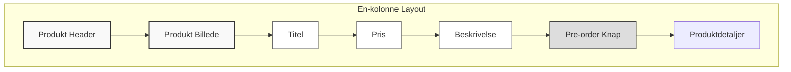
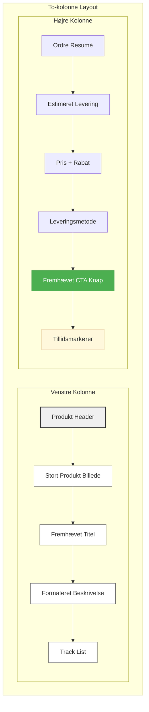
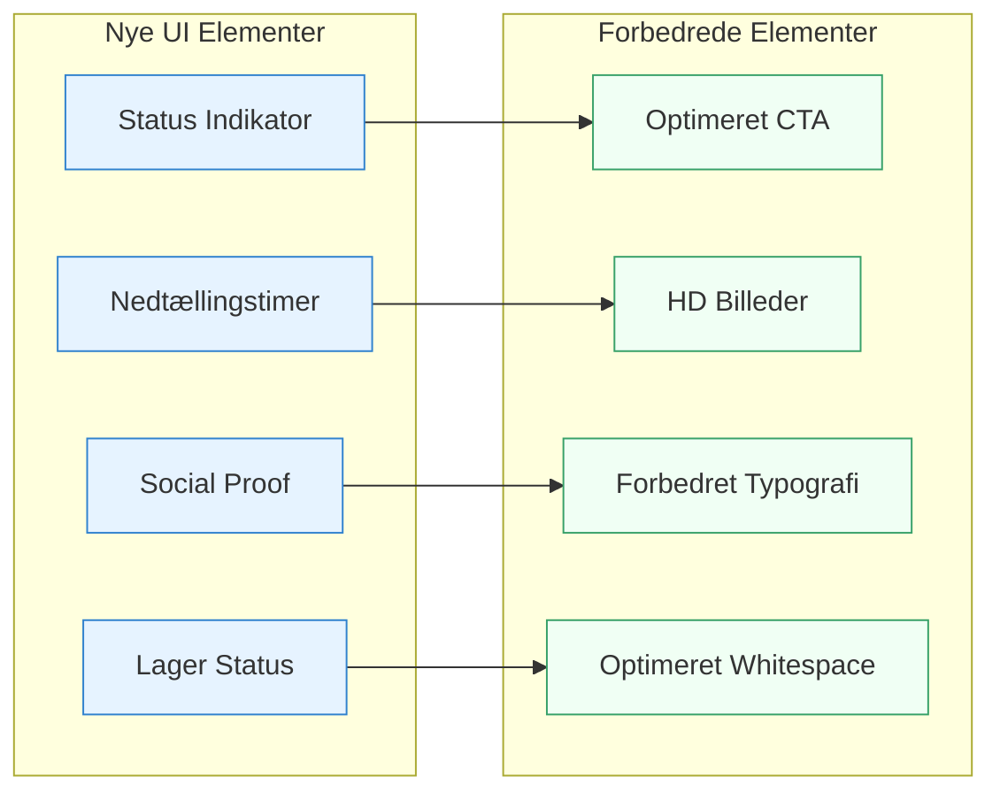
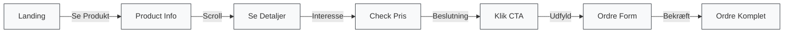
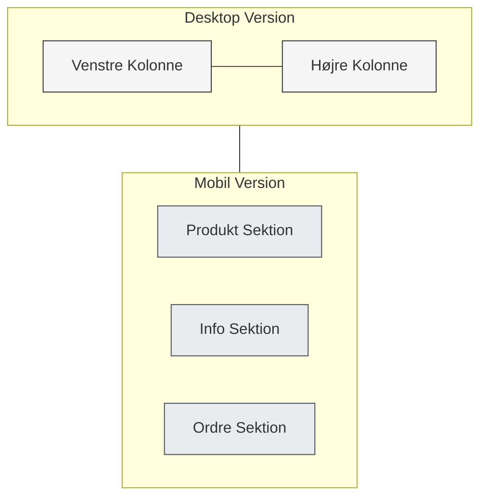

# Pre-Order UI Changes Visualization

## Før (Before)

## Efter (After)

## Forbedrede UI Elementer (Enhanced UI Elements)

## Brugerrejse (User Journey)

## Mobile Responsivt Design (Mobile Responsive Design)

