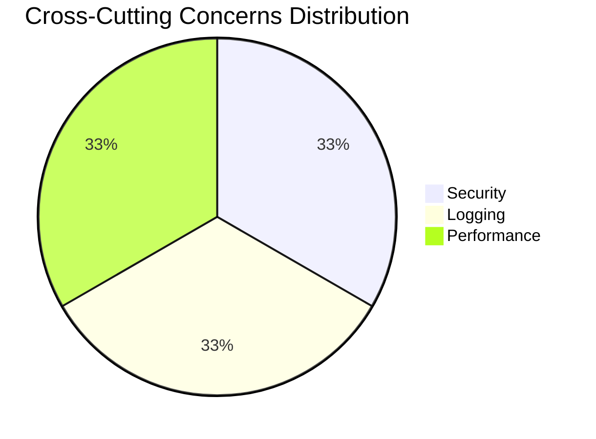

# Simplified Cross-Cutting Concerns Visualization

This diagram provides a more compact and visually intuitive representation of how cross-cutting concerns affect the different layers of the Accord Music Store application.

## Compact Cross-Cutting Concerns Diagram

```mermaid
flowchart TD
    %% Style definitions with clear color coding
    classDef presentationLayer fill:#f9d5e5,stroke:#333,stroke-width:2px
    classDef applicationLayer fill:#eeeeee,stroke:#333,stroke-width:2px
    classDef dataAccessLayer fill:#b5ead7,stroke:#333,stroke-width:2px
    classDef infrastructureLayer fill:#c7ceea,stroke:#333,stroke-width:2px
    classDef securityConcern fill:#ffcccb,stroke:#333,stroke-width:1px
    classDef loggingConcern fill:#fffacd,stroke:#333,stroke-width:1px
    classDef performanceConcern fill:#e6e6fa,stroke:#333,stroke-width:1px
    
    %% Main cross-cutting concerns
    Security[SECURITY]:::securityConcern
    Logging[LOGGING]:::loggingConcern
    Performance[PERFORMANCE]:::performanceConcern
    
    %% Main application layers
    PL[PRESENTATION LAYER]:::presentationLayer
    AL[APPLICATION LAYER]:::applicationLayer
    DAL[DATA ACCESS LAYER]:::dataAccessLayer
    IL[INFRASTRUCTURE LAYER]:::infrastructureLayer
    
    %% Group the concerns together
    subgraph CrossCutting[CROSS-CUTTING CONCERNS]
        Security
        Logging
        Performance
    end
    
    %% Connect each concern to all layers with a single arrow
    Security --> SecurityImplementations
    Logging --> LoggingImplementations
    Performance --> PerformanceImplementations
    
    %% Group the implementations by concern type
    subgraph SecurityImplementations[Security Implementations]
        PL_S[PRESENTATION<br>• User Authentication<br>• CSRF Protection<br>• Secure Forms]:::securityConcern
        AL_S[APPLICATION<br>• Session Management<br>• Role-based Access<br>• Input Sanitization]:::securityConcern
        DAL_S[DATA ACCESS<br>• Query Sanitization<br>• Connection Security<br>• Credential Protection]:::securityConcern
        IL_S[INFRASTRUCTURE<br>• Database Security<br>• API Authentication<br>• Network Protection]:::securityConcern
    end
    
    subgraph LoggingImplementations[Logging Implementations]
        PL_L[PRESENTATION<br>• Client-side Errors<br>• User Interactions<br>• UI Metrics]:::loggingConcern
        AL_L[APPLICATION<br>• Business Logic Errors<br>• Operation Tracking<br>• Audit Trails]:::loggingConcern
        DAL_L[DATA ACCESS<br>• Query Performance<br>• Data Access Patterns<br>• Error States]:::loggingConcern
        IL_L[INFRASTRUCTURE<br>• System Events<br>• Resource Usage<br>• Security Incidents]:::loggingConcern
    end
    
    subgraph PerformanceImplementations[Performance Implementations]
        PL_P[PRESENTATION<br>• Asset Optimization<br>• UI Responsiveness<br>• Page Load Speed]:::performanceConcern
        AL_P[APPLICATION<br>• Code Optimization<br>• Memory Management<br>• Caching Strategies]:::performanceConcern
        DAL_P[DATA ACCESS<br>• Query Optimization<br>• Connection Pooling<br>• Data Indexing]:::performanceConcern
        IL_P[INFRASTRUCTURE<br>• Hardware Resources<br>• Scaling Policies<br>• Load Balancing]:::performanceConcern
    end
    
    %% Connect implementations to layers with visual grouping rather than explicit arrows
    PL -.-> PL_S & PL_L & PL_P
    AL -.-> AL_S & AL_L & AL_P
    DAL -.-> DAL_S & DAL_L & DAL_P
    IL -.-> IL_S & IL_L & IL_P
```



## Ultra-Simplified Tabular View

```mermaid
graph TD
    %% Style definitions
    classDef securityConcern fill:#ffcccb,stroke:#333,stroke-width:1px
    classDef loggingConcern fill:#fffacd,stroke:#333,stroke-width:1px
    classDef performanceConcern fill:#e6e6fa,stroke:#333,stroke-width:1px
    classDef presentationLayer fill:#f9d5e5,stroke:#333,stroke-width:2px
    classDef applicationLayer fill:#eeeeee,stroke:#333,stroke-width:2px
    classDef dataAccessLayer fill:#b5ead7,stroke:#333,stroke-width:2px
    classDef infrastructureLayer fill:#c7ceea,stroke:#333,stroke-width:2px
    
    %% Header nodes
    SEC[SECURITY]:::securityConcern
    LOG[LOGGING]:::loggingConcern
    PERF[PERFORMANCE]:::performanceConcern
    
    %% Layer nodes
    PL[PRESENTATION<br>LAYER]:::presentationLayer
    AL[APPLICATION<br>LAYER]:::applicationLayer
    DAL[DATA ACCESS<br>LAYER]:::dataAccessLayer
    IL[INFRASTRUCTURE<br>LAYER]:::infrastructureLayer
    
    %% Implementation cells in tabular format
    PL_S[• User Authentication<br>• CSRF Protection<br>• Secure Forms]:::securityConcern
    PL_L[• Client-side Errors<br>• User Interactions<br>• UI Metrics]:::loggingConcern
    PL_P[• Asset Optimization<br>• UI Responsiveness<br>• Page Load Speed]:::performanceConcern
    
    AL_S[• Session Management<br>• Role-based Access<br>• Input Sanitization]:::securityConcern
    AL_L[• Business Logic Errors<br>• Operation Tracking<br>• Audit Trails]:::loggingConcern
    AL_P[• Code Optimization<br>• Memory Management<br>• Caching Strategies]:::performanceConcern
    
    DAL_S[• Query Sanitization<br>• Connection Security<br>• Credential Protection]:::securityConcern
    DAL_L[• Query Performance<br>• Data Access Patterns<br>• Error States]:::loggingConcern
    DAL_P[• Query Optimization<br>• Connection Pooling<br>• Data Indexing]:::performanceConcern
    
    IL_S[• Database Security<br>• API Authentication<br>• Network Protection]:::securityConcern
    IL_L[• System Events<br>• Resource Usage<br>• Security Incidents]:::loggingConcern
    IL_P[• Hardware Resources<br>• Scaling Policies<br>• Load Balancing]:::performanceConcern
    
    %% Position in grid format
    SEC --- PL_S
    LOG --- PL_L
    PERF --- PL_P
    
    PL --- PL_S
    PL --- PL_L
    PL --- PL_P
    
    SEC --- AL_S
    LOG --- AL_L
    PERF --- AL_P
    
    AL --- AL_S
    AL --- AL_L
    AL --- AL_P
    
    SEC --- DAL_S
    LOG --- DAL_L
    PERF --- DAL_P
    
    DAL --- DAL_S
    DAL --- DAL_L
    DAL --- DAL_P
    
    SEC --- IL_S
    LOG --- IL_L
    PERF --- IL_P
    
    IL --- IL_S
    IL --- IL_L
    IL --- IL_P
```



## Visual Summary: Concerns by Layer



```mermaid
sankey-beta
    Presentation Layer,Security,3
    Presentation Layer,Logging,3
    Presentation Layer,Performance,3
    
    Application Layer,Security,3
    Application Layer,Logging,3
    Application Layer,Performance,3
    
    Data Access Layer,Security,3
    Data Access Layer,Logging,3
    Data Access Layer,Performance,3
    
    Infrastructure Layer,Security,3
    Infrastructure Layer,Logging,3
    Infrastructure Layer,Performance,3
```

## Key Improvements in the Simplified Visualizations

1. **Reduced Number of Arrows**
   - Eliminated criss-crossing arrows by using groups and visual proximity
   - Used single arrows from concerns to their implementation groups
   - Employed dotted lines to show layer relationships without cluttering

2. **More Compact Organization**
   - Grouped related concerns together into logical subgraphs
   - Created clearer visual hierarchy
   - Used vertical flow for main diagram orientation

3. **Enhanced Readability**
   - Each implementation clearly labeled with its layer
   - Maintained the detailed bulleted lists for each intersection
   - Preserved color-coding for easy visual identification

4. **Alternative Tabular View**
   - Created an ultra-simplified table-like view
   - Shows all the same information in a more structured format
   - Eliminates most arrows in favor of position-based organization

5. **Visual Summary**
   - Added pie chart showing even distribution of concerns
   - Included Sankey diagram showing how concerns flow across layers
   - Provides at-a-glance understanding of the cross-cutting nature

These simplified visualizations maintain all the detailed information from the original diagram while making it much easier to understand at a glance how cross-cutting concerns affect each layer of the application. 