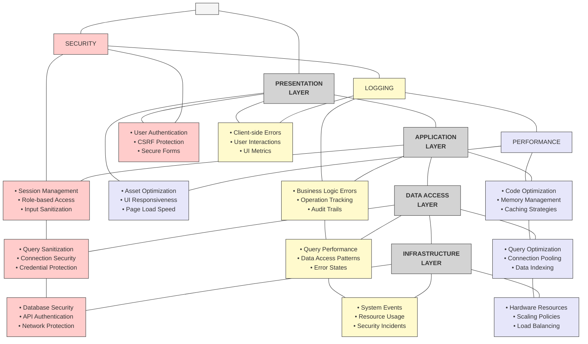
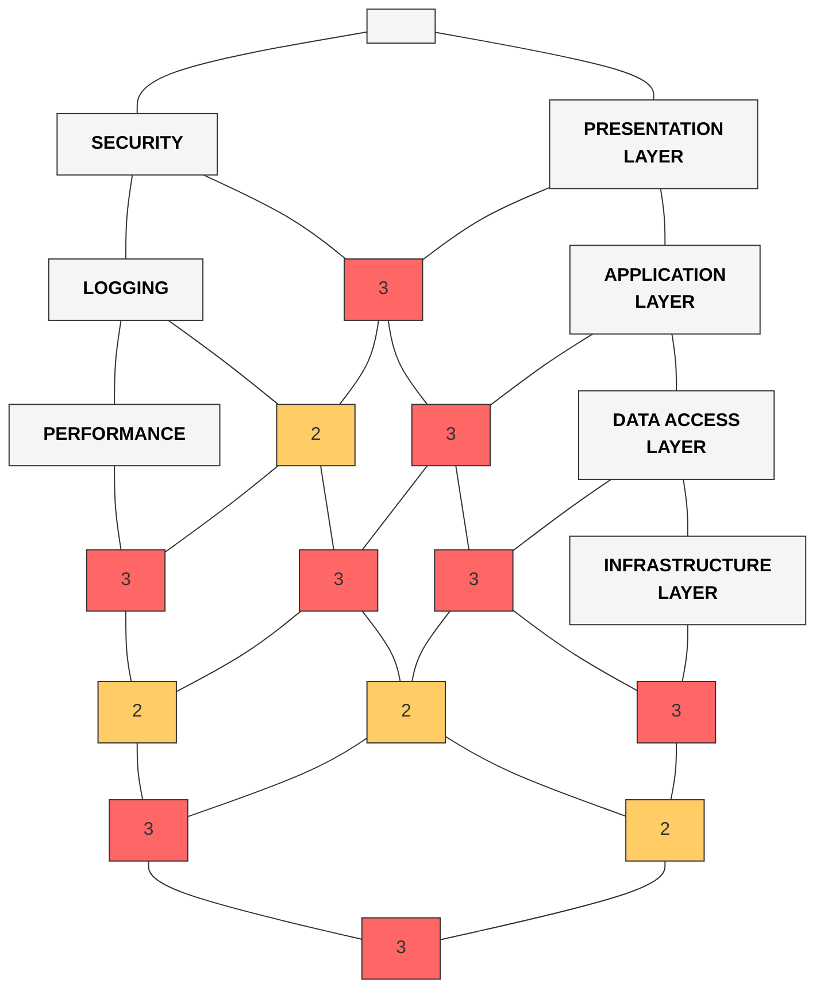
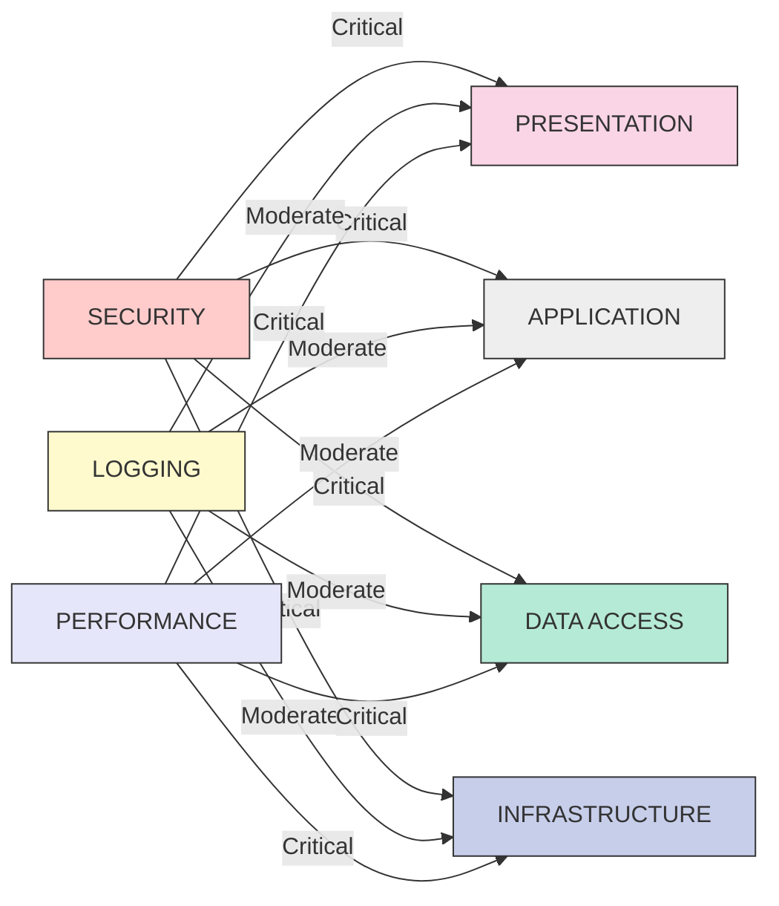
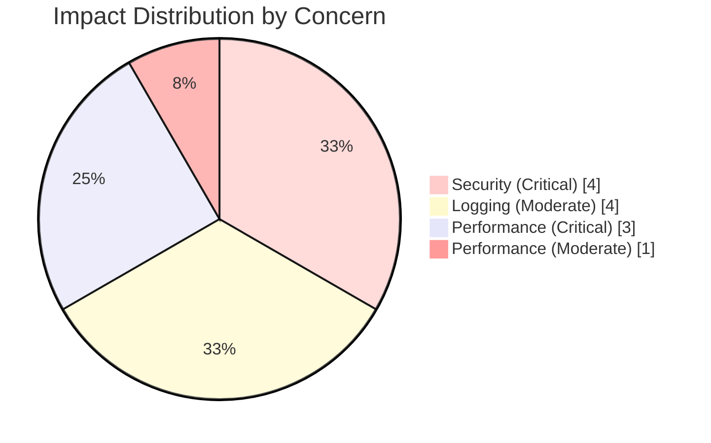

# Simplified Cross-Cutting Concerns Matrix

This matrix provides an ultra-clear visualization of how security, logging, and performance concerns affect each layer of the Accord Music Store application.

## Matrix View: Layers × Concerns

## Heatmap Visualization

For an even simpler bird's-eye view, here's a heatmap showing the coverage intensity of each concern across the application layers:

## Impact Analysis

A simplified view showing which layers are most affected by each cross-cutting concern:

## Alternate Impact Visualization

A bar chart representation of the impact levels:

## Key Benefits of the Matrix Approach

1. **Ultimate Visual Clarity**
   - Grid format eliminates all unnecessary visual elements
   - Direct mapping between concerns and layers is immediately visible
   - No crossing lines or complex relationships to interpret

2. **At-a-Glance Understanding**
   - Color coding maintains quick visual recognition
   - Position in the grid shows the relationship
   - Preserves all detailed implementations while improving organization

3. **Multiple Perspectives**
   - Matrix provides a complete detailed view
   - Heatmap offers a quantitative assessment of impact
   - Impact analysis shows relative importance of concerns per layer

4. **Easy to Update**
   - Modular design makes it simple to add new concerns or layers
   - Consistent formatting enhances maintainability
   - Clear structure serves as a template for future documentation

This matrix representation makes it exceptionally easy to understand how cross-cutting concerns affect the application, providing an immediately clear picture while maintaining all the detailed information. 