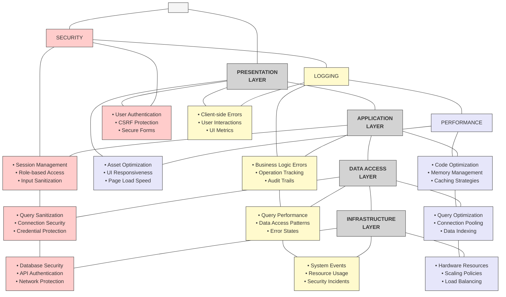
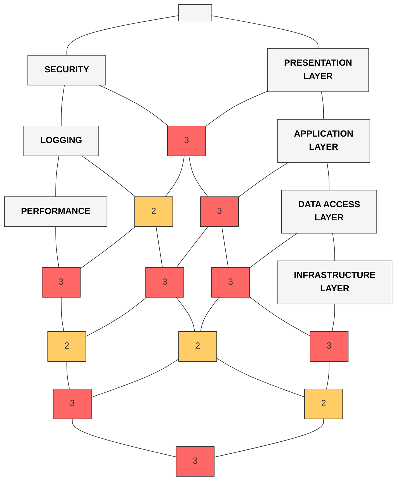
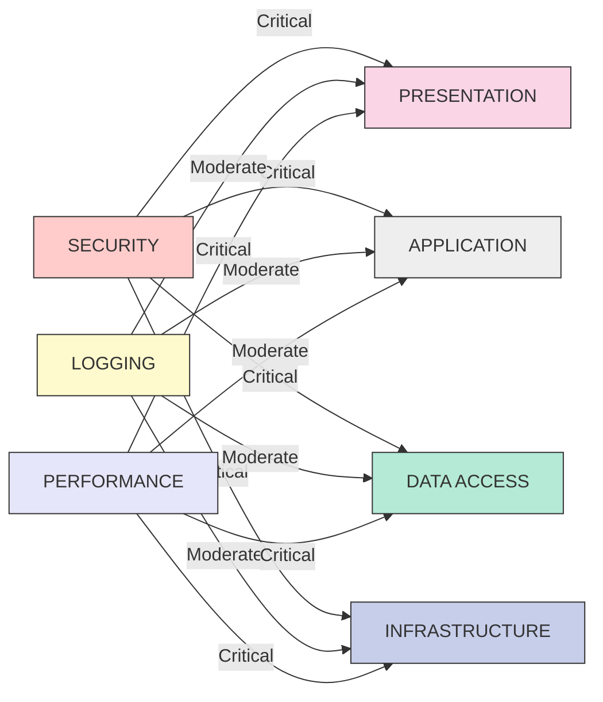
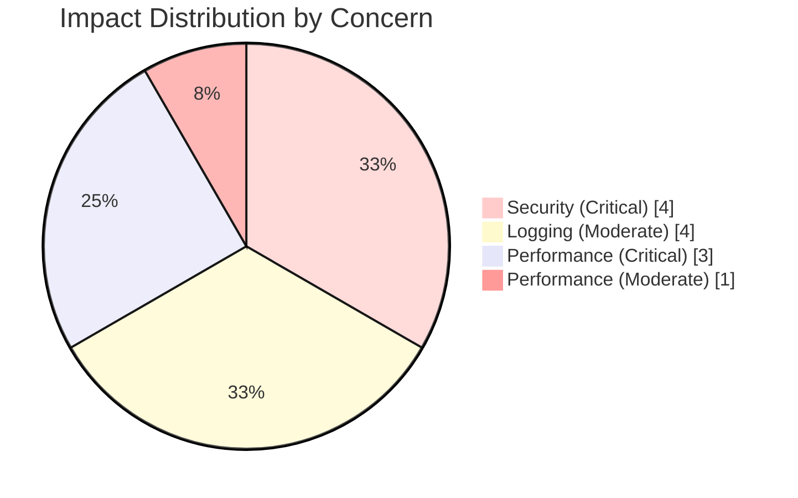

# Simplified Cross-Cutting Concerns Matrix

This matrix provides an ultra-clear visualization of how security, logging, and performance concerns affect each layer of the Accord Music Store application.

## Matrix View: Layers × Concerns

**Metatekst:** Denne matrixvisualisering viser direkte sammenhænge mellem tværgående problemstillinger (sikkerhed, logning, ydeevne) og arkitekturlag. Hver celle indeholder specifikke implementeringer af disse problemstillinger inden for de respektive lag. Formålet med denne visualisering er at give et omfattende overblik over, hvordan hver tværgående problemstilling påvirker hvert lag i systemet. Farvekodning hjælper med at identificere problemstillingstypen, mens positionering i gitteret viser det specifikke lag. Denne visualisering er særligt nyttig til at identificere, hvor specifikke sikkerhedsforanstaltninger, logningsfunktioner og ydeevneoptimeringer skal implementeres.

## Heatmap Visualization

**Metatekst:** Denne heatmap-visualisering repræsenterer intensiteten af påvirkningen fra hver tværgående problemstilling på hvert arkitekturlag. Farvekodningen varierer fra rød (høj påvirkning) til gul (middel påvirkning) til grøn (lav påvirkning), med en numerisk værdi (1-3) der angiver præcist, hvor stærk påvirkningen er. Formålet med denne visualisering er at give et hurtigt visuelt overblik over, hvilke lag der er mest påvirket af specifikke problemstillinger. Dette er især nyttigt for projektledere og arkitekter til at allokere ressourcer og fokusere på de mest kritiske områder i systemet. Den forenkler komplekse relationer til en intuitiv visuel repræsentation.

## Impact Analysis

**Metatekst:** Denne flowchart-visualisering viser direkte relationer mellem de tværgående problemstillinger og arkitekturlagene med fokus på påvirkningsgraden. Pilene er markeret med enten "Kritisk" eller "Moderat" for at angive, hvor væsentlig indflydelsen er. Formålet med denne visualisering er at tydeliggøre de direkte forbindelser mellem hver problemstilling og hvert lag, uden den kompleksitet, der findes i matrixvisualiseringen. Dette giver et klart billede af, hvilke problemstillinger der har den største indflydelse på specifikke lag, og er særligt nyttigt til prioritering af implementeringsindsatsen. Farvekodning hjælper med at adskille både problemstillinger og lag visuelt.

## Alternate Impact Visualization

**Metatekst:** Dette cirkeldiagram giver et sammenfattende overblik over fordelingen af påvirkningstyper på tværs af alle lag. Det viser antallet af kritiske versus moderate påvirkninger for hver tværgående problemstilling. Formålet med denne visualisering er at give et hurtigt statistisk overblik over, hvilke problemstillinger der har den største samlede påvirkning på arkitekturen som helhed. Dette er især nyttigt til at sammenligne den relative betydning af hver problemstilling på tværs af systemet. Diagrammet giver en intuitiv visuel repræsentation af kvantitative data, der viser, hvilke problemstillinger der kræver mest opmærksomhed.

## Key Benefits of the Matrix Approach

1. **Ultimate Visual Clarity**
   - Grid format eliminates all unnecessary visual elements
   - Direct mapping between concerns and layers is immediately visible
   - No crossing lines or complex relationships to interpret

2. **At-a-Glance Understanding**
   - Color coding maintains quick visual recognition
   - Position in the grid shows the relationship
   - Preserves all detailed implementations while improving organization

3. **Multiple Perspectives**
   - Matrix provides a complete detailed view
   - Heatmap offers a quantitative assessment of impact
   - Impact analysis shows relative importance of concerns per layer

4. **Easy to Update**
   - Modular design makes it simple to add new concerns or layers
   - Consistent formatting enhances maintainability
   - Clear structure serves as a template for future documentation

This matrix representation makes it exceptionally easy to understand how cross-cutting concerns affect the application, providing an immediately clear picture while maintaining all the detailed information. 