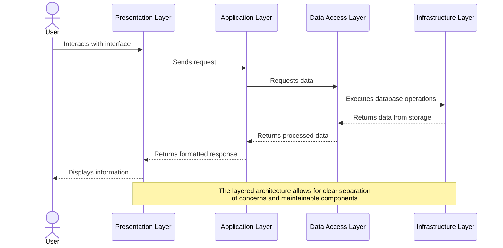
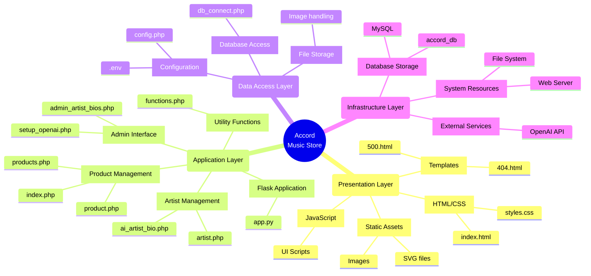

# Accord Music Store - Visual Layered Architecture

## Interactive Layered Architecture Diagram

```mermaid
flowchart TD
    classDef presentationLayer fill:#f9d5e5,stroke:#333,stroke-width:1px
    classDef applicationLayer fill:#eeeeee,stroke:#333,stroke-width:1px
    classDef dataAccessLayer fill:#b5ead7,stroke:#333,stroke-width:1px
    classDef infrastructureLayer fill:#c7ceea,stroke:#333,stroke-width:1px
    
    %% Presentation Layer
    subgraph PL[Presentation Layer]
        direction LR
        UI[HTML/CSS\nindex.html\nstyles.css]
        Templates[Templates\n404.html\n500.html]
        Assets[Static Assets\nimages\nSVG files]
        JS[JavaScript\nUI scripts]
    end
    
    %% Application Layer
    subgraph AL[Application Layer]
        direction LR
        ProductMgmt[Product Management\nindex.php\nproducts.php\nproduct.php]
        ArtistMgmt[Artist Management\nartist.php\nai_artist_bio.php]
        AdminUI[Admin Interface\nadmin_artist_bios.php\nsetup_openai.php]
        Flask[Flask Application\napp.py\nroute handlers]
        Utils[Utility Functions\nfunctions.php\nimage generation]
    end
    
    %% Data Access Layer
    subgraph DAL[Data Access Layer]
        direction LR
        DBAccess[Database Access\ndb_connect.php\nSQL queries]
        Config[Configuration\nconfig.php\n.env\nconfig.py]
        FileStorage[File Storage\nimage handling\nfile operations]
    end
    
    %% Infrastructure Layer
    subgraph IL[Infrastructure Layer]
        direction LR
        DB[Database Storage\nMySQL\naccord_db\nschema]
        ExtServices[External Services\nOpenAI API\nPayment Services]
        SysRes[System Resources\nFile System\nWeb Server]
    end
    
    %% Cross-cutting concerns
    subgraph CC[Cross-Cutting Concerns]
        direction LR
        Security[Security\nAuthentication\nAuthorization]
        Logging[Logging\nError tracking\nMonitoring]
        Performance[Performance\nOptimization]
    end
    
    %% Connections between layers
    PL --> AL
    AL --> DAL
    DAL --> IL
    
    %% Cross-cutting concerns affect all layers
    CC -.-> PL
    CC -.-> AL
    CC -.-> DAL
    CC -.-> IL
    
    %% Apply classes
    class PL presentationLayer
    class AL applicationLayer
    class DAL dataAccessLayer
    class IL infrastructureLayer
```

## Data Flow Visualization

## Component Structure Within Layers

## Benefits of the Layered Architecture

| Layer | Primary Responsibility | Key Components | Benefits |
|-------|------------------------|----------------|----------|
| **Presentation** | User interface and interaction | HTML, CSS, Templates, JavaScript | Separation of UI concerns, consistency in user experience |
| **Application** | Business logic and functionality | PHP files, Flask app, Utility functions | Centralized business rules, reusable components |
| **Data Access** | Data retrieval and storage | Database connections, Configuration | Abstraction of data operations, consistent data handling |
| **Infrastructure** | Foundational services | Database, External APIs, System resources | Isolation of external dependencies, scalability |

## Layer Interaction Example: Displaying a Product

1. User clicks on a product link (Presentation Layer)
2. Request is sent to product.php (Application Layer)
3. product.php calls db_connect.php to connect to database (Data Access Layer)
4. SQL query is executed on MySQL database (Infrastructure Layer)
5. Data is retrieved and flows back up through the layers
6. Product information is formatted and displayed to the user

This layered approach ensures that each component has a single responsibility, making the codebase easier to maintain, test, and extend. 